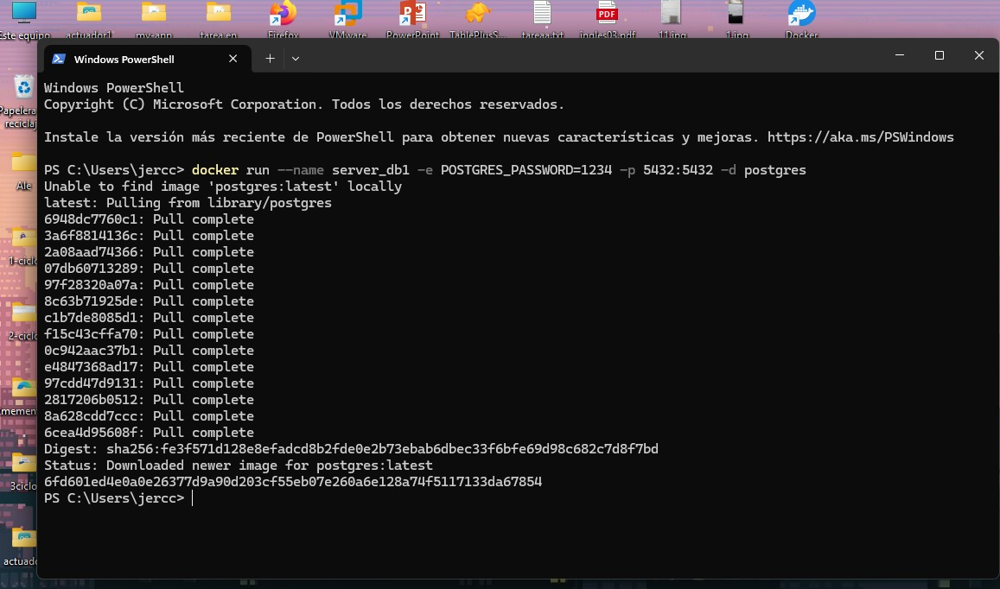
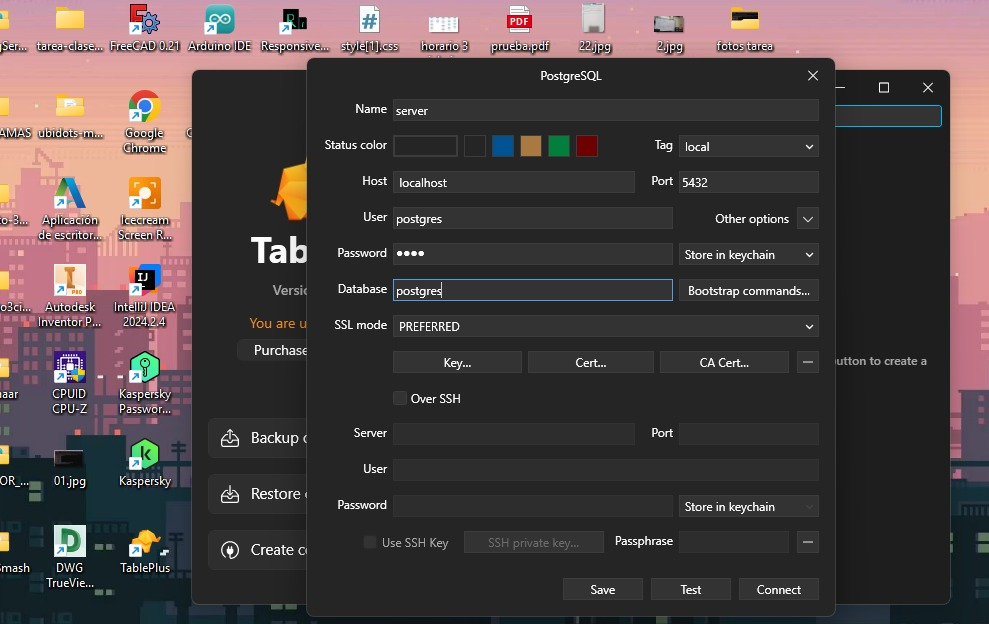
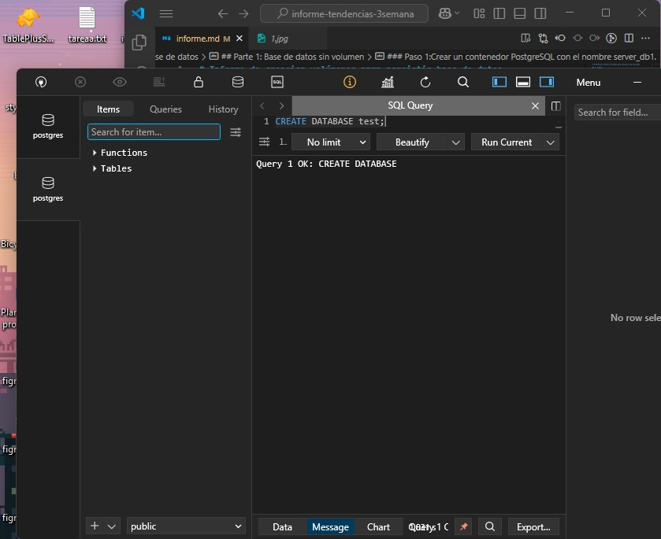
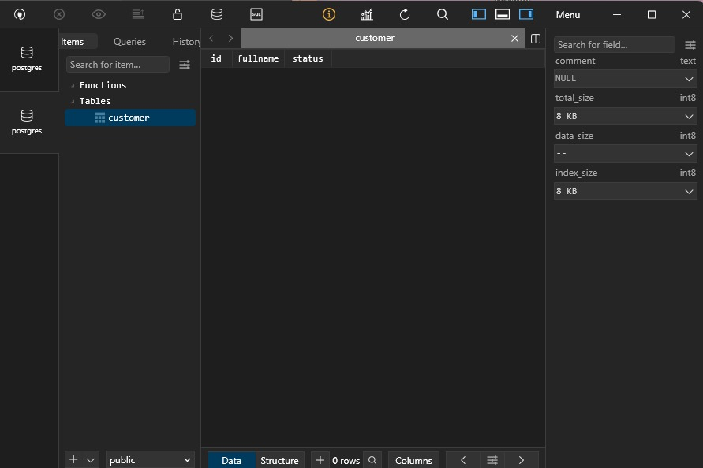
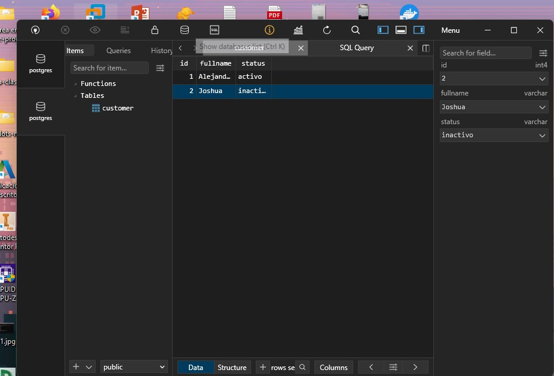

# Informe de creacion volúmenes para persistir base de datos

## 1. Titulo
TAS3 - Volúmenes para persistir base de datos
## 2. Tiempo de duración
El tiempo de duración fue de 3 horas aproximadamente para el desarrollo de la práctica.
## 3. Fundamentos:

Descripción de los conceptos para poder entender la practica, de al menos una *300* palabras, uso obligatorio de imágenes que ayuden la descripción de la teoría.

## 4. Conocimientos previos.
   
Para realizar esta practica el estudiante necesita tener claro los siguientes temas:
- Comandos lux.
- Manejo de navegador
- etc, etc

## 5. Objetivos a alcanzar
   
- Comprender la necesidad de persistencia en aplicaciones basadas en contenedores.
- Crear y gestionar volúmenes persistentes usando comandos de Docker.

  
## 6. Equipo necesario:
  
- Computador con sistema operativo Windows/Linux/Mac ...
- Cuenta en docker play....
- Docker v xxxx
- etc.

## 7. Material de apoyo.
   
- Documentacion de docker.
- Guia de asignatura.
- Cheat sheet linux
- etc
  
## 8. Procedimiento

## Parte 1: Base de datos sin volumen

### Paso 1:Crear un contenedor PostgreSQL con el nombre server_db1.
Dentro de la terminal con el contenedor se ejecuta este comando: docker run --name server_db1 -e POSTGRES_PASSWORD=1234 -p 5432:5432 -d postgres. De esta manera se crea y se ejecuta un contenedor PostgreSQL con su puerto.

### Paso 2: Conectar un administrador de base de datos (como DataGrip o TablePlus) al contenedor server_db1.
Se conecto con un administrador de base de datos, en este caso se utilizo TablePlus para poder conectar con server_db1

### Paso 3: Crear una base de datos llamada test.
Se crea la tabla llamado test, luego conectamos a la base de datos creada seleccionandola.

### Paso 4: En la base de datos test, crear una tabla llamada customer con los campos: id, fullname y status.
Se crea la tabla customer.

### Paso 5: Insertar al menos un registro en la tabla customer
Insertar registroo en eeste caso se inserto dos registros.

### Paso 6: Detener y eliminar el contenedor server_db1.
.......

### Paso 7: Volver a crear el contenedor PostgreSQL con el mismo nombre server_db1.
Ahora procedemos a hacer todos los pasos que se realizo con jdllanghinginx1 para jdllanghinginx2.

### Paso 8: Conectarse nuevamente desde el administrador de base de datos.
Ahora procedemos a hacer todos los pasos que se realizo con jdllanghinginx1 para jdllanghinginx2.

### Paso 9: Verificar que la base de datos test ya no existe, demostrando que los datos no se han conservado.
Ahora procedemos a hacer todos los pasos que se realizo con jdllanghinginx1 para jdllanghinginx2.

## Parte 2: Base de datos con volumen

### Paso 1:Crear un volumen en Docker con el comando:
Se inicia el contenedor jdllanghinginx1 en segundo plano, exponiendo el puerto interno 80 en el 8089 del host para acceder al servidor web.

### Paso 2: Crear un contenedor PostgreSQL con el nombre server_db2, asociando el volumen creado:
Se inicia el contenedor jdllanghinginx2 en segundo plano, exponiendo el puerto interno 80 en el 8090 del host para acceder al servidor web.

### Paso 3: Conectarse al contenedor con DataGrip o TablePlus.
Se copia el archivo index.html desde el contenedor jdllanghinginx1 al host como index1.html.

### Paso 4: Crear la base de datos test.
Se edita el archivo index1.html con un editor para agregar información del instituto.

### Paso 5: Crear la tabla customer con los campos: id, fullname, status.
Finalmente la pagina editada con la infomcaion del instituto.

### Paso 6: Insertar al menos un registro en la tabla.
Ahora procedemos a hacer todos los pasos que se realizo con jdllanghinginx1 para jdllanghinginx2.

### Paso 7: Detener y eliminar el contenedor server_db2.
Se edita el archivo index2.html con un editor para agregar información del estudiante.

### Paso 8: Volver a crear el contenedor server_db2 usando el volumen pgdata nuevamente.
Se edita el archivo index2.html con un editor para agregar información del estudiante.

### Paso 9: Conectarse desde el administrador de base de datos y verificar que la base de datos test y los registros han persistido.
Se edita el archivo index2.html con un editor para agregar información del estudiante.

## 9. Resultados esperados:
    
Descripcion de los resultados, capturas de pantallas del resultado final de la practica

- Ejemplo:Cada contenedor mostrará un sitio web diferente: uno con contenido institucional y otro con información personal.

- Los estudiantes habrán practicado cómo:

- Crear contenedores con docker run.

- Copiar archivos entre contenedores y el sistema anfitrión con docker cp.

- Editar archivos HTML desde la terminal usando vin

## 10. Bibliografía
    
- Docker Inc. (2024). Docker Documentation. Recuperado de: https://docs.docker.com

